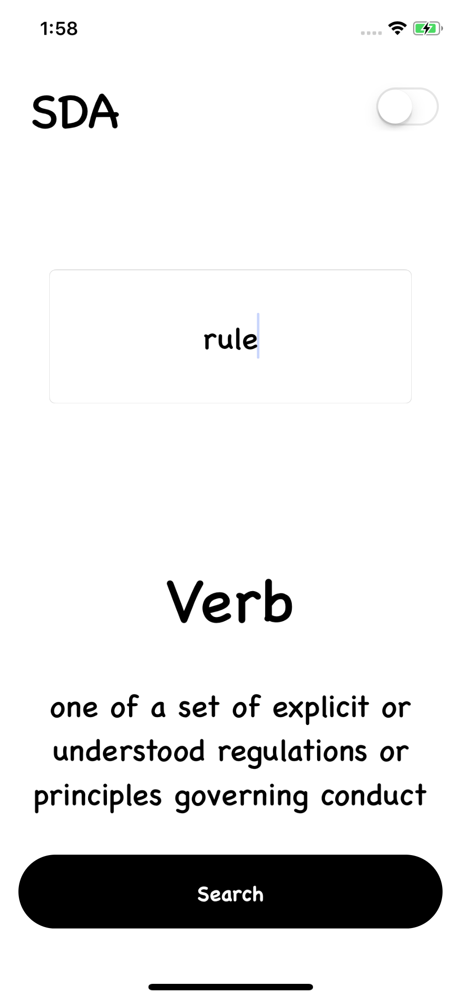

# SDA

## Overview 

Simple iOS Dictioanry app using the Oxford API to fetch nouns, verbs, pronouns, adjectives and retriving their definitions and category

## Todo

- [x] Safely Unwrap URL
- [ ] Create Logo
- [ ] Add Launch Screen
- [ ] Correctly fetch category of a word 
- [ ] Add Night Mode
- [ ] Remove spaces in searchd word

## Contributors

* <i>Medi Assumani - iOS Developer</i>
* <i><a href = "https://github.com/yveslym">Yves Songolo - Mentor/Helper/JSON Expert</a></i>

## Features 

* Quick Word Look Up
* Get instant Definition Back
* Get instant category back

## Technology and Resources  

* Oxford API
* Xcode 9.4.1
* Swift 4.1 

## Screenshots

</img>

