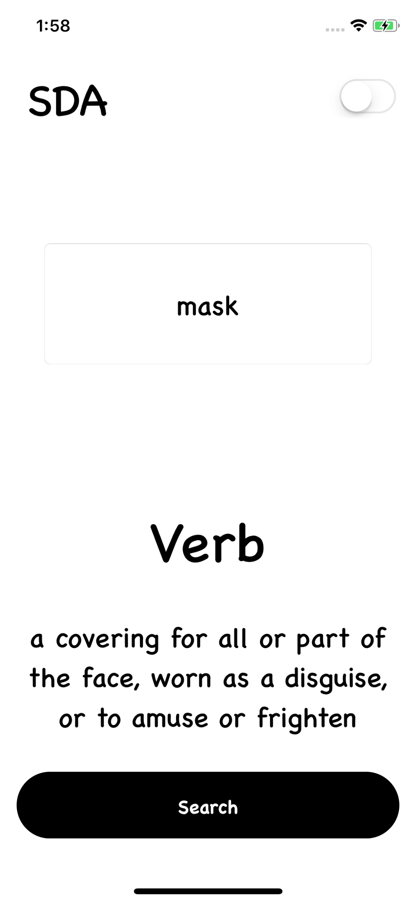
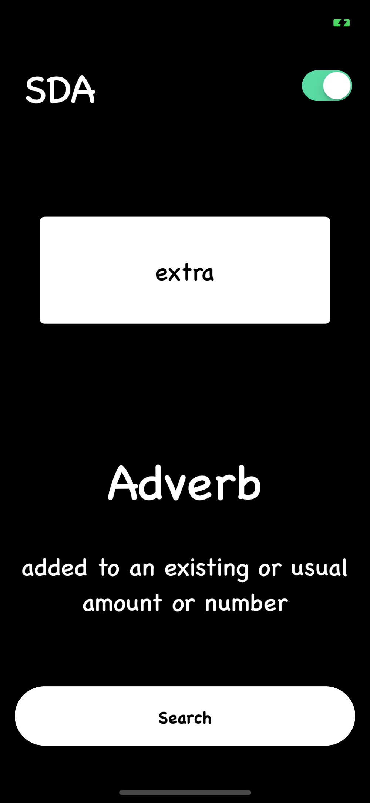

# SDA

## Overview 

Simple, Lightweight, and easy-to-use iOS Dictioanry app that is powered by the WORDSAPI to fetch nouns, verbs, pronouns, adjectives and retriving their definitions and category.

## Todo

- [x] Safely Unwrap URL
- [ ] Create Logo
- [x] Add Launch Screen
- [x] Correctly fetch category of a word 
- [x] Add Light and Night Mode theme
- [x] Remove spaces in searched word
- [ ] Add view to the app that gives credit to the WORDSAPI API

## Contributors

* <i>Medi Assumani - iOS Developer</i>
* <i><a href = "https://github.com/yveslym">Yves Songolo - Mentor/Helper/JSON God</a></i>

## Features 

* Quick Word Look Up
* Get instant Definition Back
* Get instant category back

## Technology and Resources  

* Oxford API
* Xcode 9.4.1
* Swift 4.1 

## Screenshots

</img>

